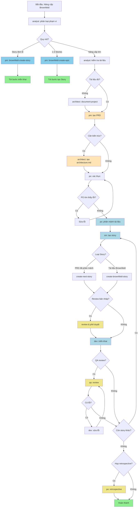

# Các Tác nhân của Dự án

Tệp này cung cấp hướng dẫn và bộ nhớ cho CLI lập trình của bạn.

## 🚨 **CODING STANDARDS COMPLIANCE**

**CRITICAL**: Khi thực hiện bất kỳ coding task nào, OpenCode **PHẢI LUÔN** tuân thủ coding standards được định nghĩa trong:

📋 **File**: `_bmad-output/planning-artifacts/architecture/coding-standards.md`

### **Quy tắc Bắt buộc:**
1. **Đọc planning artifacts TRƯỚC** khi phân tích hoặc viết code
2. **Tuân thủ Critical Fullstack Rules** (HttpOnly cookies, Server Actions, API Service Layer, etc.)
3. **Follow SQLAlchemy Async Rules** để tránh MissingGreenlet errors
4. **Apply DRY principle** và component hierarchy standards
5. **Use established naming conventions** cho tất cả code elements

### **Process Protocol:**
```
1. READ FOUNDATION FILES:
   - _bmad-output/planning-artifacts/architecture/coding-standards.md
   - _bmad-output/planning-artifacts/architecture/introduction.md  
   - _bmad-output/planning-artifacts/architecture/source-tree.md
   - _bmad-output/planning-artifacts/architecture/tech-stack.md

2. READ ARCHITECTURE CONTEXT:
   - _bmad-output/planning-artifacts/architecture/frontend-architecture.md
   - _bmad-output/planning-artifacts/architecture/data-models-and-apis.md
   - _bmad-output/planning-artifacts/architecture/api-specification.md

3. READ BUSINESS CONTEXT:
   - _bmad-output/planning-artifacts/prd.md
   - _bmad-output/planning-artifacts/epics.md
   - Relevant story files for current task

4. ANALYZE: So sánh implementation với standards
5. CODE: Tuân thủ standards khi viết/sửa code  
6. VALIDATE: Kiểm tra compliance trước khi hoàn thành
```

**⚠️ KHÔNG được ignore hoặc deviate từ coding standards trừ khi có explicit permission từ user.**

<!-- BEGIN: BMAD-AGENTS-OPENCODE -->
# Các Tác nhân và Nhiệm vụ của BMAD-METHOD (OpenCode)

OpenCode đọc tệp `AGENTS.md` trong quá trình khởi tạo và sử dụng nó như một phần của lời nhắc hệ thống cho phiên làm việc. Phần này được tạo tự động bởi BMAD-METHOD cho OpenCode.

## Cách Sử dụng với OpenCode

- Chạy `opencode` trong dự án này. OpenCode sẽ đọc `AGENTS.md` và tệp cấu hình OpenCode của bạn (`opencode.json[c]`).
- Tham chiếu một vai trò một cách tự nhiên, ví dụ: "Với vai trò dev, hãy triển khai..." hoặc sử dụng các lệnh được định nghĩa trong các nhiệm vụ BMAD của bạn.
- Commit `.bmad-core` và `AGENTS.md` nếu bạn muốn đồng đội chia sẻ cùng một cấu hình.
- Làm mới phần này sau khi cập nhật BMAD: `npx bmad-method install -f -i opencode`.

### Các Lệnh Hữu ích

- Liệt kê các tác nhân: `npx bmad-method list:agents`
- Cài đặt lại lõi BMAD và tái tạo phần này: `npx bmad-method install -f -i opencode`
- Xác thực cấu hình: `npx bmad-method validate`

**Ghi chú**
- Các Orchestrator chạy ở chế độ `primary`; các tác nhân khác ở chế độ `all`.
- Tất cả các tác nhân đều đã bật các công cụ: `write`, `edit`, `bash`.

## Các Tác nhân

### Danh mục

| Chức danh | ID | Khi nào sử dụng |
|---|---|---|
| Chuyên gia UX | ux-expert | Sử dụng cho thiết kế UI/UX, wireframe, prototype, đặc tả front-end và tối ưu hóa trải nghiệm người dùng |
| Scrum Master | sm | Sử dụng để tạo story, quản lý epic, họp retrospective ở chế độ nhóm và hướng dẫn quy trình Agile |
| Kiến trúc sư Test & Cố vấn Chất lượng | qa | Sử dụng để đánh giá toàn diện kiến trúc test, quyết định cổng chất lượng và cải thiện mã nguồn. Cung cấp phân tích kỹ lưỡng bao gồm truy vết yêu cầu, đánh giá rủi ro và chiến lược test. Chỉ mang tính chất tư vấn - các nhóm tự quyết định tiêu chuẩn chất lượng của mình. |
| Product Owner | po | Sử dụng để quản lý backlog, tinh chỉnh story, tiêu chí chấp nhận, lập kế hoạch sprint và quyết định ưu tiên |
| Product Manager | pm | Sử dụng để tạo PRD, chiến lược sản phẩm, ưu tiên tính năng, lập kế hoạch lộ trình và giao tiếp với các bên liên quan |
| Lập trình viên Full Stack | dev | Sử dụng để triển khai mã nguồn, gỡ lỗi, tái cấu trúc và các phương pháp phát triển tốt nhất |
| BMad Master Orchestrator | bmad-orchestrator | Sử dụng để điều phối luồng công việc, các nhiệm vụ đa tác nhân, hướng dẫn chuyển đổi vai trò và khi không chắc chắn nên tham khảo chuyên gia nào |
| BMad Master Task Executor | bmad-master | Sử dụng khi bạn cần chuyên môn toàn diện trên tất cả các lĩnh vực, chạy các tác vụ đơn lẻ không yêu cầu một vai trò cụ cụ thể, hoặc chỉ muốn sử dụng cùng một tác nhân cho nhiều việc. |
| Kiến trúc sư | architect | Sử dụng cho thiết kế hệ thống, tài liệu kiến trúc, lựa chọn công nghệ, thiết kế API và lập kế hoạch cơ sở hạ tầng |
| Chuyên viên Phân tích Nghiệp vụ | analyst | Sử dụng để nghiên cứu thị trường, động não, phân tích đối thủ cạnh tranh, tạo bản tóm tắt dự án, khám phá dự án ban đầu và lập tài liệu cho các dự án hiện có (brownfield) |

### Chuyên gia UX (id: ux-expert)
Source: [.bmad-core/agents/ux-expert.md](.bmad-core/agents/ux-expert.md)

- **Khi nào sử dụng:** Sử dụng cho thiết kế UI/UX, wireframe, prototype, đặc tả front-end và tối ưu hóa trải nghiệm người dùng
- **Cách kích hoạt:** Đề cập "Với vai trò ux-expert, ..." để nhận được hành vi phù hợp với vai trò
- **Định nghĩa đầy đủ:** mở tệp nguồn ở trên (nội dung không được nhúng)

### Scrum Master (id: sm)
Source: [.bmad-core/agents/sm.md](.bmad-core/agents/sm.md)

- **Khi nào sử dụng:** Sử dụng để tạo story, quản lý epic, họp retrospective ở chế độ nhóm và hướng dẫn quy trình Agile
- **Cách kích hoạt:** Đề cập "Với vai trò sm, ..." để nhận được hành vi phù hợp với vai trò
- **Định nghĩa đầy đủ:** mở tệp nguồn ở trên (nội dung không được nhúng)

### Kiến trúc sư Test & Cố vấn Chất lượng (id: qa)
Source: [.bmad-core/agents/qa.md](.bmad-core/agents/qa.md)

- **Khi nào sử dụng:** Sử dụng để đánh giá toàn diện kiến trúc test, quyết định cổng chất lượng và cải thiện mã nguồn. Cung cấp phân tích kỹ lưỡng bao gồm truy vết yêu cầu, đánh giá rủi ro và chiến lược test. Chỉ mang tính chất tư vấn - các nhóm tự quyết định tiêu chuẩn chất lượng của mình.
- **Cách kích hoạt:** Đề cập "Với vai trò qa, ..." để nhận được hành vi phù hợp với vai trò
- **Định nghĩa đầy đủ:** mở tệp nguồn ở trên (nội dung không được nhúng)

### Product Owner (id: po)
Source: [.bmad-core/agents/po.md](.bmad-core/agents/po.md)

- **Khi nào sử dụng:** Sử dụng để quản lý backlog, tinh chỉnh story, tiêu chí chấp nhận, lập kế hoạch sprint và quyết định ưu tiên
- **Cách kích hoạt:** Đề cập "Với vai trò po, ..." để nhận được hành vi phù hợp với vai trò
- **Định nghĩa đầy đủ:** mở tệp nguồn ở trên (nội dung không được nhúng)

### Product Manager (id: pm)
Source: [.bmad-core/agents/pm.md](.bmad-core/agents/pm.md)

- **Khi nào sử dụng:** Sử dụng để tạo PRD, chiến lược sản phẩm, ưu tiên tính năng, lập kế hoạch lộ trình và giao tiếp với các bên liên quan
- **Cách kích hoạt:** Đề cập "Với vai trò pm, ..." để nhận được hành vi phù hợp với vai trò
- **Định nghĩa đầy đủ:** mở tệp nguồn ở trên (nội dung không được nhúng)

### Lập trình viên Full Stack (id: dev)
Source: [.bmad-core/agents/dev.md](.bmad-core/agents/dev.md)

- **Khi nào sử dụng:** Sử dụng để triển khai mã nguồn, gỡ lỗi, tái cấu trúc và các phương pháp phát triển tốt nhất
- **Cách kích hoạt:** Đề cập "Với vai trò dev, ..." để nhận được hành vi phù hợp với vai trò
- **Định nghĩa đầy đủ:** mở tệp nguồn ở trên (nội dung không được nhúng)

### BMad Master Orchestrator (id: bmad-orchestrator)
Source: [.bmad-core/agents/bmad-orchestrator.md](.bmad-core/agents/bmad-orchestrator.md)

- **Khi nào sử dụng:** Sử dụng để điều phối luồng công việc, các nhiệm vụ đa tác nhân, hướng dẫn chuyển đổi vai trò và khi không chắc chắn nên tham khảo chuyên gia nào
- **Cách kích hoạt:** Đề cập "Với vai trò bmad-orchestrator, ..." để nhận được hành vi phù hợp với vai trò
- **Định nghĩa đầy đủ:** mở tệp nguồn ở trên (nội dung không được nhúng)

### BMad Master Task Executor (id: bmad-master)
Source: [.bmad-core/agents/bmad-master.md](.bmad-core/agents/bmad-master.md)

- **Khi nào sử dụng:** Sử dụng khi bạn cần chuyên môn toàn diện trên tất cả các lĩnh vực, chạy các tác vụ đơn lẻ không yêu cầu một vai trò cụ thể, hoặc chỉ muốn sử dụng cùng một tác nhân cho nhiều việc.
- **Cách kích hoạt:** Đề cập "Với vai trò bmad-master, ..." để nhận được hành vi phù hợp với vai trò
- **Định nghĩa đầy đủ:** mở tệp nguồn ở trên (nội dung không được nhúng)

### Kiến trúc sư (id: architect)
Source: [.bmad-core/agents/architect.md](.bmad-core/agents/architect.md)

- **Khi nào sử dụng:** Sử dụng cho thiết kế hệ thống, tài liệu kiến trúc, lựa chọn công nghệ, thiết kế API và lập kế hoạch cơ sở hạ tầng
- **Cách kích hoạt:** Đề cập "Với vai trò architect, ..." để nhận được hành vi phù hợp với vai trò
- **Định nghĩa đầy đủ:** mở tệp nguồn ở trên (nội dung không được nhúng)

### Chuyên viên Phân tích Nghiệp vụ (id: analyst)
Source: [.bmad-core/agents/analyst.md](.bmad-core/agents/analyst.md)

- **Khi nào sử dụng:** Sử dụng để nghiên cứu thị trường, động não, phân tích đối thủ cạnh tranh, tạo bản tóm tắt dự án, khám phá dự án ban đầu và lập tài liệu cho các dự án hiện có (brownfield)
- **Cách kích hoạt:** Đề cập "Với vai trò analyst, ..." để nhận được hành vi phù hợp với vai trò
- **Định nghĩa đầy đủ:** mở tệp nguồn ở trên (nội dung không được nhúng)

## Các Nhiệm vụ

Đây là các bản tóm tắt nhiệm vụ có thể tái sử dụng; sử dụng các đường dẫn để mở chúng khi cần.

### Task: validate-next-story
Source: [.bmad-core/tasks/validate-next-story.md](.bmad-core/tasks/validate-next-story.md)
- **Cách sử dụng:** Tham chiếu nhiệm vụ trong lời nhắc của bạn hoặc thực thi thông qua các lệnh đã cấu hình.
- **Bản tóm tắt đầy đủ:** mở tệp nguồn ở trên (nội dung không được nhúng)

### Task: trace-requirements
Source: [.bmad-core/tasks/trace-requirements.md](.bmad-core/tasks/trace-requirements.md)
- **Cách sử dụng:** Tham chiếu nhiệm vụ trong lời nhắc của bạn hoặc thực thi thông qua các lệnh đã cấu hình.
- **Bản tóm tắt đầy đủ:** mở tệp nguồn ở trên (nội dung không được nhúng)

### Task: test-design
Source: [.bmad-core/tasks/test-design.md](.bmad-core/tasks/test-design.md)
- **Cách sử dụng:** Tham chiếu nhiệm vụ trong lời nhắc của bạn hoặc thực thi thông qua các lệnh đã cấu hình.
- **Bản tóm tắt đầy đủ:** mở tệp nguồn ở trên (nội dung không được nhúng)

### Task: shard-doc
Source: [.bmad-core/tasks/shard-doc.md](.bmad-core/tasks/shard-doc.md)
- **Cách sử dụng:** Tham chiếu nhiệm vụ trong lời nhắc của bạn hoặc thực thi thông qua các lệnh đã cấu hình.
- **Bản tóm tắt đầy đủ:** mở tệp nguồn ở trên (nội dung không được nhúng)

### Task: risk-profile
Source: [.bmad-core/tasks/risk-profile.md](.bmad-core/tasks/risk-profile.md)
- **Cách sử dụng:** Tham chiếu nhiệm vụ trong lời nhắc của bạn hoặc thực thi thông qua các lệnh đã cấu hình.
- **Bản tóm tắt đầy đủ:** mở tệp nguồn ở trên (nội dung không được nhúng)

### Task: review-story
Source: [.bmad-core/tasks/review-story.md](.bmad-core/tasks/review-story.md)
- **Cách sử dụng:** Tham chiếu nhiệm vụ trong lời nhắc của bạn hoặc thực thi thông qua các lệnh đã cấu hình.
- **Bản tóm tắt đầy đủ:** mở tệp nguồn ở trên (nội dung không được nhúng)

### Task: qa-gate
Source: [.bmad-core/tasks/qa-gate.md](.bmad-core/tasks/qa-gate.md)
- **Cách sử dụng:** Tham chiếu nhiệm vụ trong lời nhắc của bạn hoặc thực thi thông qua các lệnh đã cấu hình.
- **Bản tóm tắt đầy đủ:** mở tệp nguồn ở trên (nội dung không được nhúng)

### Task: nfr-assess
Source: [.bmad-core/tasks/nfr-assess.md](.bmad-core/tasks/nfr-assess.md)
- **Cách sử dụng:** Tham chiếu nhiệm vụ trong lời nhắc của bạn hoặc thực thi thông qua các lệnh đã cấu hình.
- **Bản tóm tắt đầy đủ:** mở tệp nguồn ở trên (nội dung không được nhúng)

### Task: kb-mode-interaction
Source: [.bmad-core/tasks/kb-mode-interaction.md](.bmad-core/tasks/kb-mode-interaction.md)
- **Cách sử dụng:** Tham chiếu nhiệm vụ trong lời nhắc của bạn hoặc thực thi thông qua các lệnh đã cấu hình.
- **Bản tóm tắt đầy đủ:** mở tệp nguồn ở trên (nội dung không được nhúng)

### Task: index-docs
Source: [.bmad-core/tasks/index-docs.md](.bmad-core/tasks/index-docs.md)
- **Cách sử dụng:** Tham chiếu nhiệm vụ trong lời nhắc của bạn hoặc thực thi thông qua các lệnh đã cấu hình.
- **Bản tóm tắt đầy đủ:** mở tệp nguồn ở trên (nội dung không được nhúng)

### Task: generate-ai-frontend-prompt
Source: [.bmad-core/tasks/generate-ai-frontend-prompt.md](.bmad-core/tasks/generate-ai-frontend-prompt.md)
- **Cách sử dụng:** Tham chiếu nhiệm vụ trong lời nhắc của bạn hoặc thực thi thông qua các lệnh đã cấu hình.
- **Bản tóm tắt đầy đủ:** mở tệp nguồn ở trên (nội dung không được nhúng)

### Task: facilitate-brainstorming-session
Source: [.bmad-core/tasks/facilitate-brainstorming-session.md](.bmad-core/tasks/facilitate-brainstorming-session.md)
- **Cách sử dụng:** Tham chiếu nhiệm vụ trong lời nhắc của bạn hoặc thực thi thông qua các lệnh đã cấu hình.
- **Bản tóm tắt đầy đủ:** mở tệp nguồn ở trên (nội dung không được nhúng)

### Task: execute-checklist
Source: [.bmad-core/tasks/execute-checklist.md](.bmad-core/tasks/execute-checklist.md)
- **Cách sử dụng:** Tham chiếu nhiệm vụ trong lời nhắc của bạn hoặc thực thi thông qua các lệnh đã cấu hình.
- **Bản tóm tắt đầy đủ:** mở tệp nguồn ở trên (nội dung không được nhúng)

### Task: document-project
Source: [.bmad-core/tasks/document-project.md](.bmad-core/tasks/document-project.md)
- **Cách sử dụng:** Tham chiếu nhiệm vụ trong lời nhắc của bạn hoặc thực thi thông qua các lệnh đã cấu hình.
- **Bản tóm tắt đầy đủ:** mở tệp nguồn ở trên (nội dung không được nhúng)

### Task: create-next-story
Source: [.bmad-core/tasks/create-next-story.md](.bmad-core/tasks/create-next-story.md)
- **Cách sử dụng:** Tham chiếu nhiệm vụ trong lời nhắc của bạn hoặc thực thi thông qua các lệnh đã cấu hình.
- **Bản tóm tắt đầy đủ:** mở tệp nguồn ở trên (nội dung không được nhúng)

### Task: create-doc
Source: [.bmad-core/tasks/create-doc.md](.bmad-core/tasks/create-doc.md)
- **Cách sử dụng:** Tham chiếu nhiệm vụ trong lời nhắc của bạn hoặc thực thi thông qua các lệnh đã cấu hình.
- **Bản tóm tắt đầy đủ:** mở tệp nguồn ở trên (nội dung không được nhúng)

### Task: create-deep-research-prompt
Source: [.bmad-core/tasks/create-deep-research-prompt.md](.bmad-core/tasks/create-deep-research-prompt.md)
- **Cách sử dụng:** Tham chiếu nhiệm vụ trong lời nhắc của bạn hoặc thực thi thông qua các lệnh đã cấu hình.
- **Bản tóm tắt đầy đủ:** mở tệp nguồn ở trên (nội dung không được nhúng)

### Task: create-brownfield-story
Source: [.bmad-core/tasks/create-brownfield-story.md](.bmad-core/tasks/create-brownfield-story.md)
- **Cách sử dụng:** Tham chiếu nhiệm vụ trong lời nhắc của bạn hoặc thực thi thông qua các lệnh đã cấu hình.
- **Bản tóm tắt đầy đủ:** mở tệp nguồn ở trên (nội dung không được nhúng)

### Task: correct-course
Source: [.bmad-core/tasks/correct-course.md](.bmad-core/tasks/correct-course.md)
- **Cách sử dụng:** Tham chiếu nhiệm vụ trong lời nhắc của bạn hoặc thực thi thông qua các lệnh đã cấu hình.
- **Bản tóm tắt đầy đủ:** mở tệp nguồn ở trên (nội dung không được nhúng)

### Task: brownfield-create-story
Source: [.bmad-core/tasks/brownfield-create-story.md](.bmad-core/tasks/brownfield-create-story.md)
- **Cách sử dụng:** Tham chiếu nhiệm vụ trong lời nhắc của bạn hoặc thực thi thông qua các lệnh đã cấu hình.
- **Bản tóm tắt đầy đủ:** mở tệp nguồn ở trên (nội dung không được nhúng)

### Task: brownfield-create-epic
Source: [.bmad-core/tasks/brownfield-create-epic.md](.bmad-core/tasks/brownfield-create-epic.md)
- **Cách sử dụng:** Tham chiếu nhiệm vụ trong lời nhắc của bạn hoặc thực thi thông qua các lệnh đã cấu hình.
- **Bản tóm tắt đầy đủ:** mở tệp nguồn ở trên (nội dung không được nhúng)

### Task: apply-qa-fixes
Source: [.bmad-core/tasks/apply-qa-fixes.md](.bmad-core/tasks/apply-qa-fixes.md)
- **Cách sử dụng:** Tham chiếu nhiệm vụ trong lời nhắc của bạn hoặc thực thi thông qua các lệnh đã cấu hình.
- **Bản tóm tắt đầy đủ:** mở tệp nguồn ở trên (nội dung không được nhúng)

### Task: advanced-elicitation
Source: [.bmad-core/tasks/advanced-elicitation.md](.bmad-core/tasks/advanced-elicitation.md)
- **Cách sử dụng:** Tham chiếu nhiệm vụ trong lời nhắc của bạn hoặc thực thi thông qua các lệnh đã cấu hình.
- **Bản tóm tắt đầy đủ:** mở tệp nguồn ở trên (nội dung không được nhúng)

<!-- END: BMAD-AGENTS-OPENCODE -->

## Quy trình Chuẩn (Workflows)

Phần này mô tả các quy trình công việc chuẩn được sử dụng trong dự án.

### Quy trình: Nâng cấp Full-Stack cho Dự án Hiện có (Brownfield)
Source: `.bmad-core/workflows/brownfield-fullstack.yaml`

**Mô tả:** Quy trình công việc của Tác nhân để nâng cấp các ứng dụng full-stack hiện có với các tính năng mới, hiện đại hóa hoặc các thay đổi quan trọng. Xử lý việc phân tích hệ thống hiện tại và tích hợp an toàn.

**Sơ đồ luồng công việc:**


### Diễn giải Chi tiết Quy trình "Nâng cấp Brownfield"

Quy trình này được thiết kế để quản lý các yêu cầu thay đổi hoặc bổ sung tính năng cho một dự án đã tồn tại. Nó bắt đầu bằng việc đánh giá quy mô và kết thúc khi tất cả các thay đổi đã được triển khai và xác nhận.

#### Giai đoạn 1: Phân loại và Lập kế hoạch (Analyze & Plan)

1.  **Bắt đầu (Start):** Mọi yêu cầu nâng cấp đều bắt đầu từ đây.
2.  **`analyst: phân loại phạm vi` (Analyst: Classify Scope):** Chuyên viên phân tích (`analyst`) sẽ đánh giá yêu cầu để xác định quy mô và độ phức tạp của nó.
3.  **`Quy mô?` (Scope?):** Dựa trên phân tích, công việc được chia thành một trong ba luồng:
    *   **"Story đơn lẻ" (Single Story):** Nếu là một thay đổi nhỏ, độc lập.
    *   **"1-3 Stories":** Nếu là một tính năng vừa phải, có thể gói gọn trong vài story.
    *   **"Nâng cấp lớn" (Major Upgrade):** Nếu là một thay đổi lớn, phức tạp, ảnh hưởng đến nhiều phần của hệ thống.

#### Giai đoạn 2: Xử lý theo Quy mô

*   **Nếu là "Story đơn lẻ":**
    *   **`pm: brownfield-create-story`:** Product Manager (`pm`) tạo một story duy nhất cho công việc và chuyển thẳng đến giai đoạn triển khai.
*   **Nếu là "1-3 Stories":**
    *   **`pm: brownfield-create-epic`:** Product Manager tạo một epic (một nhóm các story liên quan) để quản lý công việc. Sau đó, các story con sẽ được tạo từ epic này.
*   **Nếu là "Nâng cấp lớn" (Quy trình chi tiết):**
    1.  **`analyst: kiểm tra tài liệu` (Analyst: Check Documentation):** Chuyên viên phân tích kiểm tra tài liệu hiện có của dự án.
    2.  **`Tài liệu đủ?` (Sufficient Documentation?):**
        *   **Không (No):** Nếu tài liệu thiếu hoặc lỗi thời, **`architect: document-project`** (Kiến trúc sư) sẽ cập nhật hoặc tạo mới tài liệu kỹ thuật cần thiết.
        *   **Có (Yes):** Chuyển sang bước tiếp theo.
    3.  **`pm: tạo PRD` (PM: Create Product Requirements Document):** Dựa trên tài liệu đã có, Product Manager tạo một tài liệu yêu cầu sản phẩm (PRD).
    4.  **`Cần kiến trúc?` (Architecture Needed?):**
        *   **Có (Yes):** Nếu yêu cầu thay đổi lớn về mặt kỹ thuật, **`architect: tạo architecture.md`** (Kiến trúc sư) sẽ thiết kế và tạo tài liệu kiến trúc mới.
        *   **Không (No):** Bỏ qua bước thiết kế kiến trúc.
    5.  **`po: xác thực` (Product Owner: Validate):** Product Owner (`po`) xem xét tất cả các tài liệu (PRD, kiến trúc) để đảm bảo chúng phù hợp với tầm nhìn sản phẩm.
    6.  **`Lỗi?` (Errors?):** Nếu PO phát hiện vấn đề, yêu cầu sẽ được trả lại để **`Sửa lỗi`**. Nếu không, tiếp tục.
    7.  **`po: phân mảnh tài liệu` (Product Owner: Shard Document):** PO chia nhỏ các tài liệu yêu cầu lớn thành các phần nhỏ hơn, dễ quản lý hơn để chuẩn bị cho việc tạo story.
    8.  **`sm: tạo story` (Scrum Master: Create Story):** Dựa trên các tài liệu đã được phân mảnh, Scrum Master (`sm`) tạo các user story cụ thể để nhóm phát triển có thể làm việc.

#### Giai đoạn 3: Triển khai và Kiểm thử (Implement & Test)

Đây là một chu trình lặp đi lặp lại cho đến khi tất cả các story được hoàn thành.

1.  **`dev: triển khai` (Developer: Implement):** Lập trình viên (`dev`) nhận story và bắt đầu viết mã nguồn cho các tính năng được yêu cầu.
2.  **`QA review?` (QA Review?):**
    *   **Có (Yes)::**
        *   **`qa: review`:** Chuyên viên đảm bảo chất lượng (`qa`) kiểm tra mã nguồn và chức năng để tìm lỗi.
        *   **`Có lỗi?` (Bugs Found?):**
            *   **Có (Yes):** Nếu tìm thấy lỗi, story được trả lại cho **`dev: sửa lỗi`** (Developer: Fix Bugs). Sau khi sửa xong, nó sẽ được gửi lại cho `qa` để kiểm tra lại.
            *   **Không (No)::** Nếu không có lỗi, story được coi là hoàn thành.
    *   **Không (No):** Bỏ qua bước kiểm tra chất lượng.
3.  **`Còn story khác?` (Any stories left?):** Hệ thống kiểm tra xem còn story nào trong epic hoặc backlog cần thực hiện không.
    *   **Có (Yes):** Quay lại bước **`sm: tạo story`** hoặc **`dev: triển khai`** để tiếp tục vòng lặp.
    *   **Không (No):** Tất cả các story đã hoàn thành. Chuyển sang giai đoạn cuối cùng.

#### Giai đoạn 4: Hoàn thành và Họp tổng kết (Completion & Retrospective)

1.  **`Họp retrospective?` (Hold Retrospective?):** Sau khi tất cả công việc hoàn tất, nhóm có thể quyết định tổ chức một cuộc họp tổng kết.
    *   **Có (Yes):** **`po: retrospective`** (Product Owner) sẽ tổ chức một cuộc họp để cả nhóm cùng nhìn lại những gì đã làm tốt và những gì có thể cải thiện trong các lần lặp sau.
    *   **Không (No)::** Bỏ qua cuộc họp.
2.  **`Hoàn thành` (Completed):** Quy trình nâng cấp kết thúc thành công.

Tóm lại, đây là một quy trình có cấu trúc chặt chẽ, bắt đầu bằng việc phân tích và lập kế hoạch cẩn thận, sau đó chuyển sang giai đoạn phát triển lặp đi lặp lại với sự kiểm soát chất lượng, và cuối cùng kết thúc bằng việc tổng kết và rút kinh nghiệm.

### Vai trò của PRD (Product Requirements Document)

Dựa trên quy trình, PRD là một tài liệu trung tâm được áp dụng cho các **"Nâng cấp lớn"**. Dưới đây là vai trò và người sử dụng nó:

#### 1. Ai sử dụng PRD?

*   **Product Manager (PM):** Là người **tạo ra** PRD để định hình và truyền đạt tầm nhìn của sản phẩm hoặc tính năng.
*   **Architect (Kiến trúc sư):** **Tham khảo** PRD để quyết định xem có cần thay đổi về mặt kiến trúc hệ thống hay không và nếu có thì thiết kế như thế nào cho phù hợp.
*   **Product Owner (PO):** **Xác thực** PRD để đảm bảo nó phù hợp với chiến lược và ưu tiên của sản phẩm. Sau đó, PO **sử dụng** nó để "phân mảnh" thành các yêu cầu nhỏ hơn.
*   **Scrum Master (SM):** **Dựa vào** các tài liệu đã được PO phân mảnh từ PRD để tạo ra các User Story cụ thể cho đội ngũ phát triển.
*   **Developer (Dev) và QA:** Là người dùng cuối cùng của các "sản phẩm" được tạo ra từ PRD (chính là các User Story). PRD đảm bảo các story này nhất quán và đúng mục tiêu.

#### 2. PRD được dùng để làm gì?

PRD đóng vai trò là "nguồn sự thật duy nhất" (single source of truth) cho một bản nâng cấp lớn. Cụ thể:

1.  **Để thống nhất tầm nhìn:** Nó đảm bảo tất cả mọi người, từ quản lý sản phẩm đến kỹ sư, đều hiểu rõ **"Chúng ta đang xây dựng cái gì?"** và **"Tại sao chúng ta xây dựng nó?"**.
2.  **Để định rõ phạm vi:** PRD mô tả chi tiết các tính năng, yêu cầu, và mục tiêu của bản nâng cấp, giúp tránh việc "lạc đề" hoặc làm thiếu chức năng trong quá trình phát triển.
3.  **Làm cơ sở để phân chia công việc:** Như trong sơ đồ, PRD là đầu vào cốt lõi để Product Owner phân rã yêu cầu lớn thành các phần nhỏ hơn, và từ đó Scrum Master mới tạo ra các User Story mà lập trình viên có thể thực hiện.

### Các Tài liệu/Sản phẩm trong Quy trình

Dưới đây là danh sách các tài liệu/sản phẩm chính được tạo ra trong quy trình "Nâng cấp Brownfield", cùng với vai trò của người tạo ra và người sử dụng chúng.

#### 1. Epic
*   **Khi nào tạo:** Khi phạm vi công việc được xác định là "1-3 Stories".
*   **Ai tạo:** `pm` (Product Manager).
*   **Ai sử dụng:**
    *   `po` (Product Owner): Để theo dõi tiến độ của một nhóm tính năng liên quan.
    *   `sm` (Scrum Master): Để từ Epic này tạo ra các User Story con.

#### 2. Project Documentation (Tài liệu Dự án)
*   **Khi nào tạo:** Khi một "Nâng cấp lớn" được yêu cầu nhưng tài liệu hiện có của dự án bị thiếu hoặc đã lỗi thời.
*   **Ai tạo:** `architect` (Kiến trúc sư).
*   **Ai sử dụng:**
    *   `pm` (Product Manager): Dùng làm nền tảng để tạo PRD.
    *   Toàn bộ đội ngũ (`dev`, `qa`, `analyst`): Để tham khảo, hiểu rõ hơn về hệ thống hiện tại trước khi thực hiện thay đổi.

#### 3. PRD (Product Requirements Document)
*   **Khi nào tạo:** Khi thực hiện một "Nâng cấp lớn".
*   **Ai tạo:** `pm` (Product Manager).
*   **Ai sử dụng:** Đã được giải thích chi tiết ở phần trước, bao gồm `architect`, `po`, và `sm`.

#### 4. `architecture.md` (Tài liệu Kiến trúc)
*   **Khi nào tạo:** Khi "Nâng cấp lớn" có yêu cầu thay đổi đáng kể về mặt kỹ thuật/hệ thống.
*   **Ai tạo:** `architect` (Kiến trúc sư).
*   **Ai sử dụng:**
    *   `po` (Product Owner): Để xác thực và đảm bảo thiết kế kỹ thuật đáp ứng yêu cầu nghiệp vụ.
    *   `dev` (Developer): Dùng làm bản thiết kế chi tiết để triển khai mã nguồn.
    *   `qa` (Quality Assurance): Để hiểu rõ luồng hệ thống, từ đó thiết kế kịch bản kiểm thử phù hợp.

#### 5. Sharded Documents (Tài liệu được phân mảnh)
*   **Khi nào tạo:** Sau khi PRD của một "Nâng cấp lớn" đã được PO xác thực.
*   **Ai tạo:** `po` (Product Owner).
*   **Ai sử dụng:**
    *   `sm` (Scrum Master): Đây là đầu vào **trực tiếp** để tạo ra các User Story. Mỗi "mảnh" tài liệu là một yêu cầu đủ nhỏ để biến thành một hoặc vài story.

#### 6. User Story
*   **Khi nào tạo:** Trong cả 3 luồng (Story đơn lẻ, Epic, hoặc từ tài liệu phân mảnh).
*   **Ai tạo:** `sm` (Scrum Master) hoặc `pm` (Product Manager) trong trường hợp đơn giản.
*   **Ai sử dụng:**
    *   `dev` (Developer): Để biết chính xác cần phải xây dựng chức năng gì.
    *   `qa` (Quality Assurance): Để biết cần phải kiểm thử những gì và tiêu chí nghiệm thu ra sao.
    *   `po` (Product Owner): Để nghiệm thu và chấp nhận story sau khi hoàn thành.