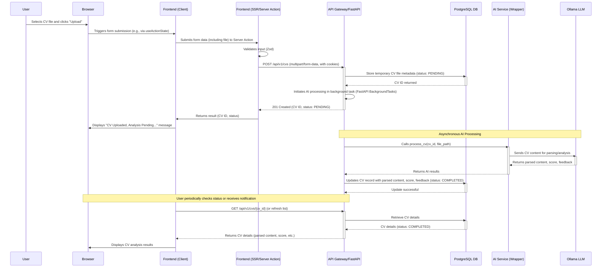

# Core Workflows

## Job Seeker Uploads CV for Analysis

```mermaid
sequenceDiagram
    participant User
    participant Browser
    participant Frontend_Client as Frontend (Client)
    participant Frontend_SSR as Frontend (SSR/Server Action)
    participant API_Gateway as API Gateway/FastAPI
    participant DB as PostgreSQL DB
    participant AIS as AI Service (Wrapper)
    participant Ollama as Ollama LLM

    User->>Browser: Selects CV file and clicks "Upload"
    Browser->>Frontend_Client: Triggers form submission (e.g., via useActionState)
    Frontend_Client->>Frontend_SSR: Submits form data (including file) to Server Action
    Frontend_SSR->>Frontend_SSR: Validates input (Zod)
    Frontend_SSR->>API_Gateway: POST /api/v1/cvs (multipart/form-data, with cookies)
    activate API_Gateway
    API_Gateway->>DB: Store temporary CV file metadata (status: PENDING)
    activate DB
    DB-->>API_Gateway: CV ID returned
    deactivate DB
    API_Gateway->>API_Gateway: Initiates AI processing in background task (FastAPI BackgroundTasks)
    API_Gateway-->>Frontend_SSR: 201 Created (CV ID, status: PENDING)
    deactivate API_Gateway
    Frontend_SSR->>Frontend_Client: Returns result (CV ID, status)
    Frontend_Client->>Browser: Displays "CV Uploaded, Analysis Pending..." message

    Note over API_Gateway,Ollama: Asynchronous AI Processing

    API_Gateway->>AIS: Calls process_cv(cv_id, file_path)
    activate AIS
    AIS->>Ollama: Sends CV content for parsing/analysis
    activate Ollama
    Ollama-->>AIS: Returns parsed content, score, feedback
    deactivate Ollama
    AIS-->>API_Gateway: Returns AI results
    deactivate AIS
    API_Gateway->>DB: Updates CV record with parsed content, score, feedback (status: COMPLETED)
    activate DB
    DB-->>API_Gateway: Update successful
    deactivate DB

    Note over API_Gateway,Browser: User periodically checks status or receives notification

    Frontend_Client->>API_Gateway: GET /api/v1/cvs/{cv_id} (or refresh list)
    activate API_Gateway
    API_Gateway->>DB: Retrieve CV details
    activate DB
    DB-->>API_Gateway: CV details (status: COMPLETED)
    deactivate DB
    API_Gateway-->>Frontend_Client: Returns CV details (parsed content, score, etc.)
    deactivate API_Gateway
    Frontend_Client->>Browser: Displays CV analysis results
```

---