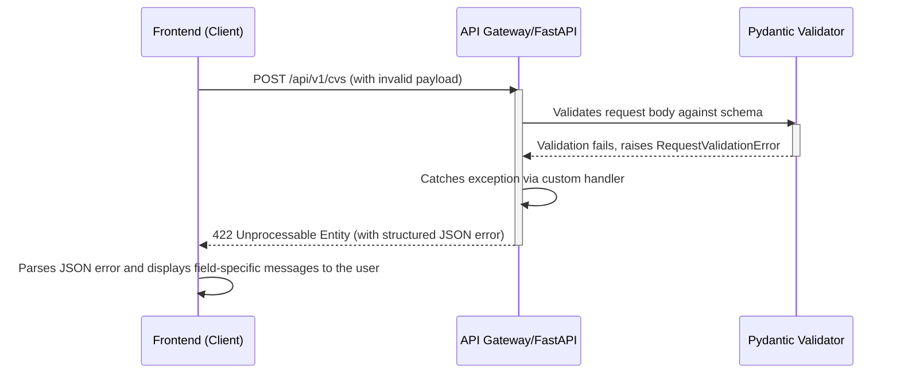

# Error Handling Strategy

## Error Flow

This diagram illustrates the flow when the backend validation fails for an API request.



## Error Response Format

To ensure consistency, all API errors will adhere to the following JSON structure. This provides a machine-readable error code, a human-readable message, and optional details for field-specific validation errors.

```typescript
interface ApiError {
  error: {
    code: string; // e.g., 'VALIDATION_ERROR', 'UNAUTHENTICATED', 'RESOURCE_NOT_FOUND'
    message: string; // User-friendly error message
    details?: Record<string, any>; // For field-specific validation errors
    timestamp: string; // ISO 8601 timestamp
  };
}

// Example for a validation error:
// {
//   "error": {
//     "code": "VALIDATION_ERROR",
//     "message": "One or more fields are invalid.",
//     "details": {
//       "email": "A user with this email already exists.",
//       "password": "Password must be at least 8 characters long."
//     },
//     "timestamp": "2025-12-10T10:00:00Z"
//   }
// }
```

## Frontend Error Handling

Errors will be handled globally in the frontend's `API Service Layer` using an `axios` response interceptor. This centralizes error logic and makes UI components cleaner.

```typescript
// src/services/api-client.ts (interceptor part)
import axios from 'axios';

const apiClient = axios.create({ /* ... */ });

apiClient.interceptors.response.use(
  response => response,
  error => {
    if (axios.isAxiosError(error) && error.response) {
      const apiError = error.response.data as ApiError;
      const status = error.response.status;

      switch (status) {
        case 401:
          // Unauthorized: User is not logged in or token expired.
          // Redirect to login page.
          console.error("Unauthorized access. Redirecting...", apiError.error.message);
          window.location.href = '/login'; // Or use Next.js router
          break;
        case 403:
          // Forbidden: User is logged in but lacks permissions.
          console.error("Forbidden access.", apiError.error.message);
          // Redirect to an 'unauthorized' page.
          break;
        case 422:
          // Validation Error: Let the calling function handle field-specific errors.
          console.warn("Validation error:", apiError.error.details);
          break;
        default:
          // Generic server error (5xx)
          console.error("An unexpected server error occurred:", apiError.error.message);
          // Show a generic error toast/notification to the user.
          break;
      }
    } else {
      // Network error or other non-Axios error
      console.error("A network or unknown error occurred:", error.message);
    }
    // Propagate the error so that individual UI components can also react if needed.
    return Promise.reject(error);
  }
);

export default apiClient;
```

## Backend Error Handling

In FastAPI, custom exception handlers will be used to catch specific errors and format them into our standard `ApiError` response.

```python
# backend/app/main.py

from fastapi import FastAPI, Request, status
from fastapi.responses import JSONResponse
from fastapi.exceptions import RequestValidationError
from datetime import datetime, timezone

app = FastAPI()

# Custom handler for Pydantic validation errors
@app.exception_handler(RequestValidationError)
async def validation_exception_handler(request: Request, exc: RequestValidationError):
    error_details = {}
    for error in exc.errors():
        field = ".".join(map(str, error["loc"]))
        error_details[field] = error["msg"]

    return JSONResponse(
        status_code=status.HTTP_422_UNPROCESSABLE_ENTITY,
        content={
            "error": {
                "code": "VALIDATION_ERROR",
                "message": "One or more fields are invalid.",
                "details": error_details,
                "timestamp": datetime.now(timezone.utc).isoformat(),
            }
        },
    )

# Custom handler for a generic application exception
class AppBaseException(Exception):
    def __init__(self, message: str, code: str = "GENERIC_ERROR", status_code: int = 500):
        self.message = message
        self.code = code
        self.status_code = status_code

@app.exception_handler(AppBaseException)
async def app_exception_handler(request: Request, exc: AppBaseException):
    return JSONResponse(
        status_code=exc.status_code,
        content={
            "error": {
                "code": exc.code,
                "message": exc.message,
                "timestamp": datetime.now(timezone.utc).isoformat(),
            }
        },
    )

# ... include routers and other app setup
```

---