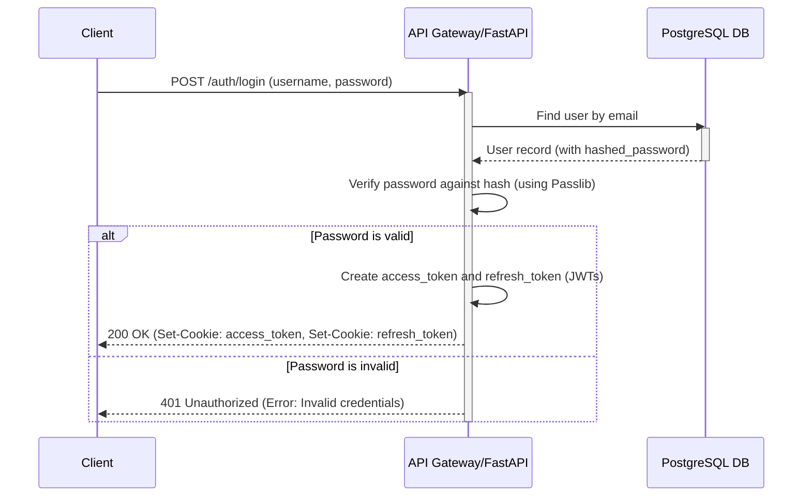

# Backend Architecture

This section describes the internal architecture of our Python-based backend, including service organization, data access patterns, and the authentication flow. We are using a traditional server approach to support the local Ollama LLM.

## Service Architecture

### Traditional Server Architecture

The backend is a monolithic application with a modular design, running on a traditional server (e.g., a Linux VM). Each business feature (e.g., auth, cvs, jobs) is encapsulated within its own module, promoting a clean separation of concerns.

#### Controller/Route Organization
Routes are organized by feature into separate `router.py` files within each module. These routers are then aggregated in the main `main.py` file. This keeps the API definitions clean and organized by domain.

```plaintext
backend/app/
├── main.py               # Main application entry point, includes all routers
└── modules/
    ├── auth/
    │   └── router.py       # Contains /auth/* endpoints
    ├── users/
    │   └── router.py       # Contains /users/* endpoints
    ├── cvs/
    │   └── router.py       # Contains /cvs/* endpoints
    └── jobs/
        └── router.py       # Contains /jobs/* endpoints
```

#### Controller Template
A standard router file defines API endpoints using FastAPI's decorators and depends on the service layer for business logic.

```python
# backend/app/modules/cvs/router.py

from fastapi import APIRouter, Depends, UploadFile, File, HTTPException
from sqlalchemy.ext.asyncio import AsyncSession
from typing import List

from app.core.database import get_db
from app.modules.auth.dependencies import get_current_user
from app.modules.users.models import User
from . import schemas, service

router = APIRouter(prefix="/cvs", tags=["CVs"])

@router.post("/", response_model=schemas.CV, status_code=201)
async def upload_cv(
    *,
    db: AsyncSession = Depends(get_db),
    current_user: User = Depends(get_current_user),
    file: UploadFile = File(...)
):
    """
    Upload a new CV for the current user.
    Initiates AI analysis in a background task.
    """
    if file.content_type not in ["application/pdf", "application/vnd.openxmlformats-officedocument.wordprocessingml.document"]:
        raise HTTPException(status_code=400, detail="Invalid file type. Only PDF and DOCX are accepted.")

    new_cv = await service.create_cv(db=db, user=current_user, file=file)
    return new_cv

@router.get("/", response_model=List[schemas.CV])
async def get_user_cvs(
    *,
    db: AsyncSession = Depends(get_db),
    current_user: User = Depends(get_current_user)
):
    """
    Retrieve all CVs uploaded by the current user.
    """
    cvs = await service.get_cvs_by_user(db=db, user_id=current_user.id)
    return cvs

# ... other CV endpoints
```

## Database Architecture

### Schema Design
The database schema is designed for PostgreSQL and includes tables for `users`, `cvs`, and `job_descriptions`. It utilizes `pgvector` for semantic search and appropriate indexes for performance.

```sql
-- Assumes the 'pgvector' extension is installed: CREATE EXTENSION IF NOT EXISTS vector;

CREATE TABLE IF NOT EXISTS users (
    id UUID PRIMARY KEY DEFAULT gen_random_uuid(),
    email VARCHAR(255) UNIQUE NOT NULL,
    hashed_password VARCHAR(255) NOT NULL,
    is_active BOOLEAN NOT NULL DEFAULT TRUE,
    created_at TIMESTAMP WITHOUT TIME ZONE DEFAULT CURRENT_TIMESTAMP,
    updated_at TIMESTAMP WITHOUT TIME ZONE DEFAULT CURRENT_TIMESTAMP
);

CREATE TABLE IF NOT EXISTS cvs (
    id UUID PRIMARY KEY DEFAULT gen_random_uuid(),
    user_id UUID NOT NULL REFERENCES users(id) ON DELETE CASCADE,
    filename VARCHAR(255) NOT NULL,
    file_path TEXT NOT NULL,
    uploaded_at TIMESTAMP WITHOUT TIME ZONE DEFAULT CURRENT_TIMESTAMP,
    parsed_content JSONB,
    summary TEXT,
    quality_score INTEGER,
    ats_compatibility_feedback TEXT,
    is_active BOOLEAN NOT NULL DEFAULT TRUE,
    extracted_skills TEXT[],
    total_experience_years INTEGER,
    embedding VECTOR(768)
);

CREATE TABLE IF NOT EXISTS job_descriptions (
    id UUID PRIMARY KEY DEFAULT gen_random_uuid(),
    user_id UUID NOT NULL REFERENCES users(id) ON DELETE CASCADE,
    title VARCHAR(255) NOT NULL,
    description TEXT NOT NULL,
    uploaded_at TIMESTAMP WITHOUT TIME ZONE DEFAULT CURRENT_TIMESTAMP,
    is_active BOOLEAN NOT NULL DEFAULT TRUE,
    required_skills TEXT[],
    min_experience_years INTEGER,
    location_type VARCHAR(50) NOT NULL CHECK (location_type IN ('remote', 'hybrid', 'on-site')),
    salary_min INTEGER,
    salary_max INTEGER,
    embedding VECTOR(768)
);

-- Indexes are defined on all foreign keys, vector columns, and commonly filtered fields.
```

### Data Access Layer
A **Repository Pattern** (realized as a "Service Layer") is used to abstract all database interactions. The `router` layer calls the `service` layer, which in turn interacts with the SQLAlchemy `models`. This separates business logic from API routing and improves testability.

```python
# backend/app/modules/cvs/service.py

from sqlalchemy.ext.asyncio import AsyncSession
from sqlalchemy.future import select
from fastapi import UploadFile
import shutil
import uuid

from . import models, schemas
from app.modules.users.models import User
from app.core.ai_service import process_cv_in_background # Fictional AI service call

async def create_cv(db: AsyncSession, user: User, file: UploadFile):
    # 1. Save file to disk
    file_extension = file.filename.split('.')[-1]
    file_id = uuid.uuid4()
    file_path = f"/path/to/storage/{file_id}.{file_extension}"
    with open(file_path, "wb") as buffer:
        shutil.copyfileobj(file.file, buffer)

    # 2. Create DB entry
    db_cv = models.CV(
        user_id=user.id,
        filename=file.filename,
        file_path=file_path,
        # Other fields will be populated by the AI task
    )
    db.add(db_cv)
    await db.commit()
    await db.refresh(db_cv)

    # 3. Trigger background AI processing
    process_cv_in_background(cv_id=db_cv.id, file_path=file_path)

    return db_cv

async def get_cvs_by_user(db: AsyncSession, user_id: uuid.UUID):
    result = await db.execute(
        select(models.CV)
        .where(models.CV.user_id == user_id, models.CV.is_active == True)
        .order_by(models.CV.uploaded_at.desc())
    )
    return result.scalars().all()
```

## Authentication and Authorization

### Auth Flow
The authentication flow uses HttpOnly cookies for security, which is ideal for web applications and SSR contexts.



### Middleware/Guards
FastAPI uses a dependency injection system to protect endpoints. A `get_current_user` dependency is injected into any protected route. This function is responsible for reading the `access_token` cookie, validating the JWT, and retrieving the corresponding user from the database.

```python
# backend/app/modules/auth/dependencies.py

from fastapi import Depends, HTTPException, status
from fastapi.security import APIKeyCookie
from jose import JWTError
from sqlalchemy.ext.asyncio import AsyncSession

from app.core.database import get_db
from app.core.security import decode_access_token
from app.modules.users import service as user_service
from app.modules.users.models import User

# This tells FastAPI to look for a cookie named 'access_token'
cookie_scheme = APIKeyCookie(name="access_token", auto_error=False)

async def get_current_user(
    db: AsyncSession = Depends(get_db),
    token: str = Depends(cookie_scheme)
) -> User:
    if token is None:
        raise HTTPException(
            status_code=status.HTTP_401_UNAUTHORIZED,
            detail="Not authenticated",
        )
    try:
        payload = decode_access_token(token)
        user_id = payload.get("sub")
        if user_id is None:
            raise HTTPException(status_code=status.HTTP_401_UNAUTHORIZED, detail="Invalid token")
    except JWTError:
        raise HTTPException(status_code=status.HTTP_401_UNAUTHORIZED, detail="Invalid token")

    user = await user_service.get_user(db=db, user_id=user_id)
    if user is None or not user.is_active:
        raise HTTPException(status_code=status.HTTP_401_UNAUTHORIZED, detail="User not found or inactive")

    return user
```

---