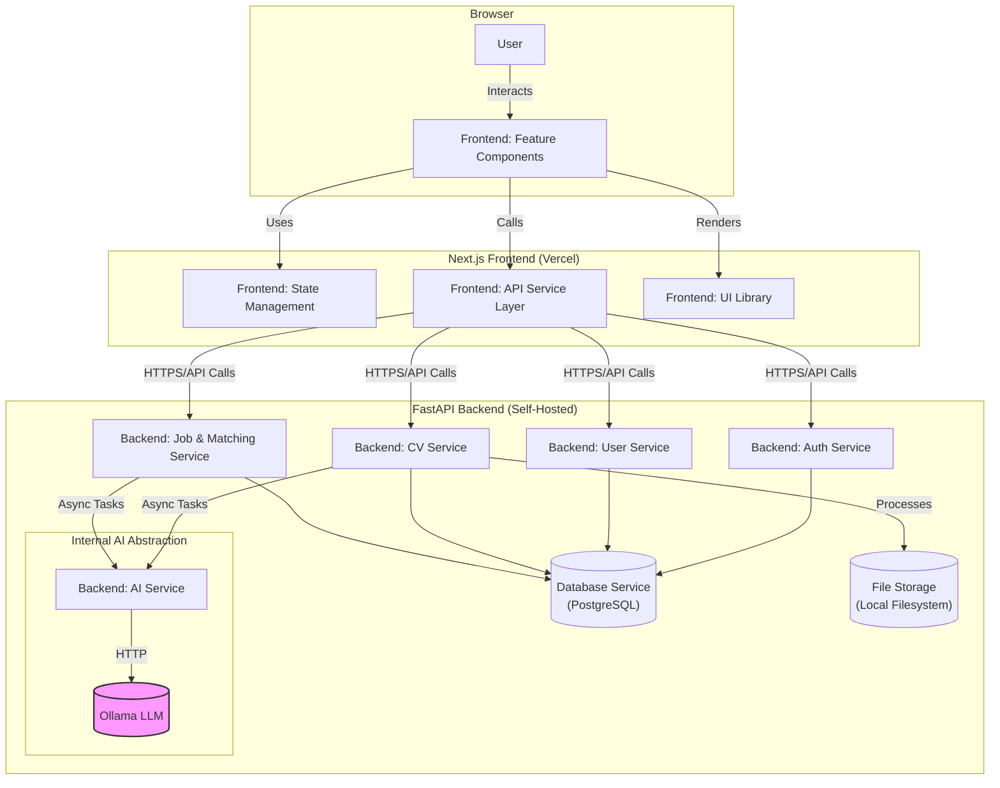

# Components

## Component List

### Backend Components

**Auth Service**
-   **Responsibility:** Handles user registration, login/logout, password management, and JWT/cookie generation.
-   **Key Interfaces:** Provides `/api/v1/auth/*` endpoints.
-   **Dependencies:** `User Service`, `Database Service`.
-   **Technology Stack:** FastAPI, Passlib, python-jose, SQLAlchemy.

**User Service**
-   **Responsibility:** Manages user profile data and state.
-   **Key Interfaces:** Provides `/api/v1/users/me` endpoint.
-   **Dependencies:** `Database Service`.
-   **Technology Stack:** FastAPI, SQLAlchemy.

**CV Processing Service**
-   **Responsibility:** Manages CV uploads, storage, and orchestrates the AI analysis pipeline (parsing, scoring, feedback).
-   **Key Interfaces:** Provides `/api/v1/cvs/*` endpoints.
-   **Dependencies:** `AI Service`, `Database Service`, `File Storage`.
-   **Technology Stack:** FastAPI, SQLAlchemy, BackgroundTasks.

**Job & Matching Service**
-   **Responsibility:** Manages Job Description uploads and orchestrates the AI-powered candidate matching and semantic search.
-   **Key Interfaces:** Provides `/api/v1/jobs/*` endpoints.
-   **Dependencies:** `AI Service`, `Database Service`.
-   **Technology Stack:** FastAPI, SQLAlchemy.

**AI Service (Ollama Wrapper)**
-   **Responsibility:** A dedicated internal service that acts as a wrapper around the Ollama LLM. It abstracts the raw AI calls into specific business functions like `parse_cv(file_content)` or `rank_candidates(jd_text, cv_texts)`.
-   **Key Interfaces:** Internal Python functions (not a public API).
-   **Dependencies:** Ollama LLM service endpoint.
-   **Technology Stack:** Python (`httpx` or `aiohttp` for async calls to Ollama).

### Frontend Components

**API Service Layer (`/services`)**
-   **Responsibility:** Encapsulates all communication with the backend REST API. It abstracts away `fetch`/`axios` calls and standardizes error handling and authentication header/cookie management. This is where we will handle the cookie forwarding for SSR as noted.
-   **Key Interfaces:** Provides async functions (e.g., `authService.login()`, `cvService.uploadCV()`).
-   **Dependencies:** Next.js Server Actions, `axios`.
-   **Technology Stack:** TypeScript, Axios.

**Feature Components (`/features`)**
-   **Responsibility:** Self-contained UI and logic for major business features (e.g., `LoginForm`, `CVUploadForm`). They handle user interaction and orchestrate calls to the API Service Layer.
-   **Key Interfaces:** React components consumed by the main application pages.
-   **Dependencies:** `API Service Layer`, `UI Component Library`, `State Management`.
-   **Technology Stack:** React, Next.js, `react-hook-form`.

**UI Component Library (`/components/ui`)**
-   **Responsibility:** Provides the set of generic, reusable, and style-compliant UI primitives based on `shadcn/ui`.
-   **Key Interfaces:** React component props (e.g., `<Button>`, `<Input>`).
-   **Dependencies:** React, Tailwind CSS.
-   **Technology Stack:** React, Radix UI, `class-variance-authority`.

**State Management**
-   **Responsibility:** Manages client-side state, both local (component state) and global (user session).
-   **Key Interfaces:** React Hooks (`useState`, `useContext`) and `useActionState` for form interactions.
-   **Dependencies:** React.
-   **Technology Stack:** React Hooks, React Context API.

## Component Diagrams

Here is a C4-style Container diagram showing the high-level relationships between these logical components.

---