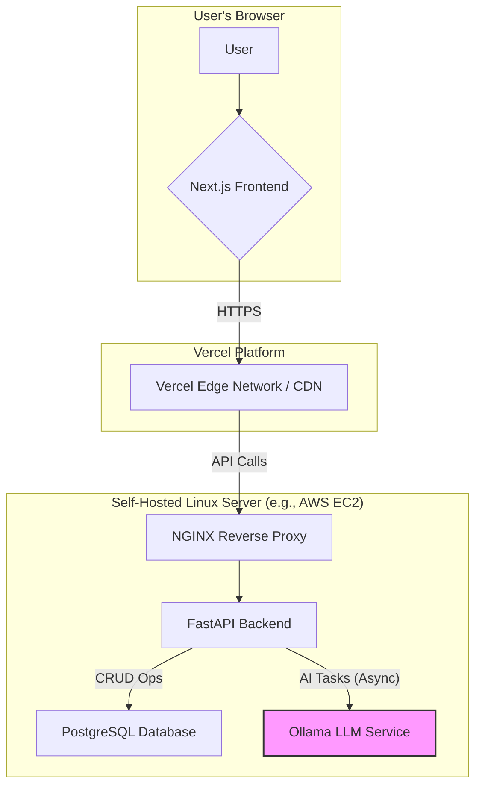

# High Level Architecture

## Technical Summary

The architecture is a modern full-stack application composed of a Next.js frontend and a Python (FastAPI) backend, designed for modularity and scalability. The frontend will be deployed on Vercel to leverage its powerful CDN and CI/CD capabilities. The backend, along with the PostgreSQL database and the Ollama AI service, will be self-hosted on a dedicated Linux server to comply with the critical requirement of local, private AI data processing. Integration between the frontend and backend is achieved via a RESTful API, secured with an HttpOnly cookie-based authentication flow. This architecture directly supports the PRD goals by providing a high-performance user experience, ensuring data privacy for sensitive CV and JD information, and creating a scalable foundation for future AI-driven features.

## Platform and Infrastructure Choice

Based on the PRD's requirement for local AI processing (NFR5) and the need for a high-performance frontend, a hybrid platform approach is recommended.

**Platform:** **Vercel (Frontend)** + **Self-Hosted Server (Backend & AI)**
**Key Services:**
*   **Vercel:** Next.js Hosting, Global CDN, CI/CD (for Frontend).
*   **Self-Hosted Server (Linux - Ubuntu 22.04 LTS):**
    *   **FastAPI Backend Hosting:** Running the Python application via Uvicorn.
    *   **PostgreSQL:** Relational database for application data.
    *   **Ollama:** Serving local Large Language Models for all AI tasks.
    *   **NGINX:** As a reverse proxy for the FastAPI application.
**Deployment Host and Regions:**
*   **Vercel:** Deployed to Vercel's global edge network.
*   **Self-Hosted Server:** A single server instance will be provisioned in a secure data center (e.g., AWS EC2, DigitalOcean, or on-premise). The specific region should be chosen to minimize latency for the primary user base.

## Repository Structure

The project will use a **Monorepo** structure to manage the `frontend` and `backend` applications within a single Git repository. This approach simplifies dependency management and facilitates code sharing.

**Structure:** Monorepo
**Monorepo Tool:** **npm Workspaces** (Leveraging built-in npm capabilities is sufficient for the current scale and avoids adding extra dependencies).
**Package Organization:**
*   `apps/frontend`: The Next.js application.
*   `apps/backend`: The FastAPI application.
*   `packages/shared-types`: A new shared package for TypeScript interfaces and Zod schemas used by both frontend and backend to ensure type safety across the stack.

## High Level Architecture Diagram

## Architectural Patterns

- **Modular Monolith (Backend):** The FastAPI backend is organized into feature-based modules (e.g., `auth`, `users`, `cvs`). This provides clear separation of concerns while maintaining the simplicity of a single deployment unit.
- **Jamstack (Frontend):** The Next.js application leverages static site generation (SSG) for shell pages and client-side rendering (CSR) for dynamic, user-specific data, ensuring optimal performance and SEO.
- **Server Actions (Frontend):** For mutations and data fetching from the client, Next.js Server Actions will be used. This co-locates data operations with the components that use them, simplifying client-side state management.
- **Asynchronous Task Processing (Backend):** For long-running AI operations like CV parsing, FastAPI's `BackgroundTasks` will be used to immediately return a response to the user while processing the task in the background, as required by NFR2.
- **Repository Pattern (Backend):** The use of a `service.py` layer in each module abstracts business logic from the API endpoints (`router.py`) and data access, improving testability and maintainability.

---
See [Technology Stack](./tech-stack.md) for details.

---